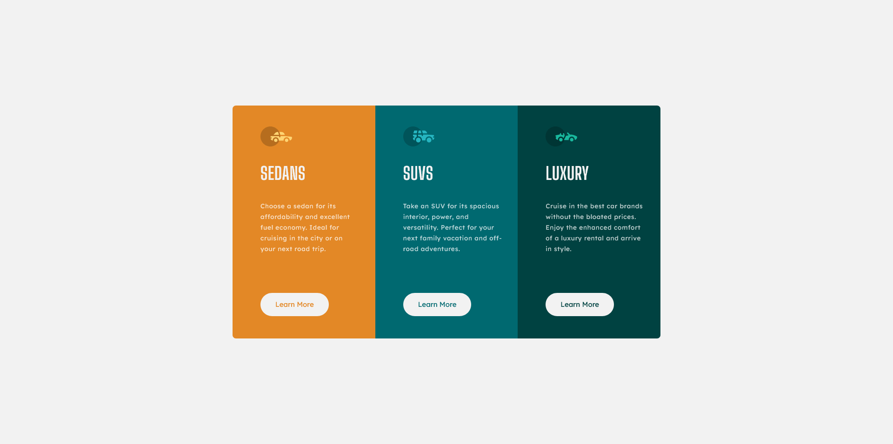

# Frontend Mentor - 3-column preview card component solution

This is a solution to the [3-column preview card component challenge on Frontend Mentor](https://www.frontendmentor.io/challenges/3column-preview-card-component-pH92eAR2-). Frontend Mentor challenges help you improve your coding skills by building realistic projects. 

## Table of contents

- [Overview](#overview)
  - [The challenge](#the-challenge)
  - [Screenshot](#screenshot)
  - [Links](#links)
- [My process](#my-process)
  - [Built with](#built-with)
  - [What I learned](#what-i-learned)
  - [Continued development](#continued-development)
- [Author](#author)

## Overview

### The challenge

Users should be able to:

- View the optimal layout depending on their device's screen size
- See hover states for interactive elements

### Screenshot




### Links

- Solution URL: [Github](https://github.com/MikeBeloborodov/3-column-card)
- Live Site URL: [Netlify](https://silver-buttercream-4e7f64.netlify.app/)

## My process

### Built with

- Semantic HTML5 markup
- CSS custom properties
- Flexbox
- CSS Grid
- Mobile-first workflow

### What I learned

I had a problem with a button border, when I applied it on hoover effect, everything below moved down a little bit because of 2px border size, so as a solution to stop this behavior I added this border before hover and made it transparent, so it's always there but invisible:

```CSS
.btn {
    border: 0.15rem solid transparent;
}

.btn:hover {
    border: 0.15rem solid var(--clr-very-light-gray);
}
```

Also used grid to make 3 columns on a desktop version: 

```CSS
@media(min-width: 770px) {
    .preview-box {
        display: grid;
        grid-template-columns: 1fr 1fr 1fr;
    }
}
```

### Continued development

I feel more comfortable with rem units now and responsive design in general, but I have a lot to learn still, gotta practice more.

## Author

- Github - [Mike Beloborodov](https://github.com/MikeBeloborodov)
- Frontend Mentor - [@MikeBeloborodov](https://www.frontendmentor.io/profile/MikeBeloborodov)
